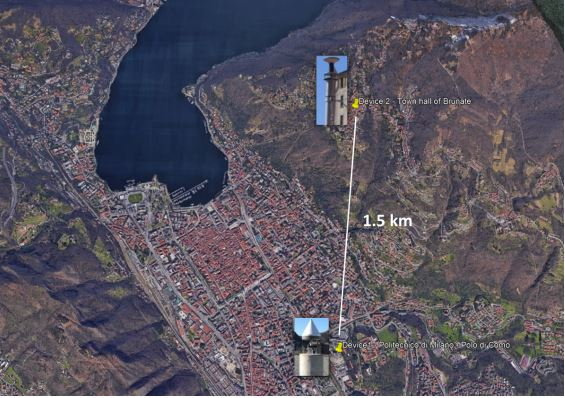

# Positioning & Location Based Services

Welcome to the repository for my labs activities of the **Positioning and Location-Based Services** course at Politecnico! 

This collection houses the comprehensive lab results for the eight diverse exercises undertaken during the course. These exercises encompass a broad spectrum of topics crucial to understanding positioning systems and location-based services. Here's a brief overview of each exercise:

## 1 - Transformation betwween Reference Frames
The workflow involves computing various coordinates, including Geocentric Cartesian, Local Cartesian, and Geodetic, for specified locations at specific epochs. Additionally, it incorporates conversions, rotations, and accuracy propagation between different coordinate systems.

    

## 2 - Orbits Computation
The workflow involves computing clock offsets, satellite positions in the Orbital Reference System (ORS) and ITRF, converting coordinates, and plotting the groundtrack. The process is executed for each 30-second epoch, creating a text file with ORS, ITRF, and geodetic coordinates.

    

## 3 - Ionospheric Effect
The workflow involves computing four maps of ionospheric error corrections for varying elevation, latitude, and longitude, as well as two polar maps for an observer in Milan. The computations are based on ionospheric parameters and involve specific steps for each type of map.

    

## 4 - Point Positioning
The workflow involves enhancing provided scripts for single-frequency code observations. It utilizes least squares to compute receiver coordinates, clock offset, and PDOP. The process iteratively refines estimates until corrections approach zero, providing accurate positioning results with Python or Matlab.

## 5 - Cycle Slip Analysis
The workflow involves importing and graphing observed DDs, computing epoch differences, and identifying cycle slips based on a threshold. Repairing cycle slips is done by subtracting the identified value from subsequent observations. The process is iteratively checked until all cycle slips are repaired.

    

## 6 - Inertial Navigation
The task involves computing a vehicle's trajectory in an inertial system using simulated observations with and without errors. Initial conditions, including velocities and coordinates, are provided. The process includes computing velocities, incremental positions, asset angles, and transforming positions from the Body system to the Inertial system for plotting and comparison.

## 7 - Indoor Positioning
The task involves Wi-Fi fingerprinting in a rectangular room with known beacons and control points. Calibration data from control points and user-collected RSSI measurements are used to estimate user trajectory and coordinates for 25 points, creating informative plots.

    

## 8 - Trajectories Comparisons
The task involves importing RTK and smartphone trajectory data into Matlab, plotting them together, and assessing smartphone trajectory errors by finding the nearest RTK points, computing distances, and generating error plots with statistics (mean, max, min, STD).

    

